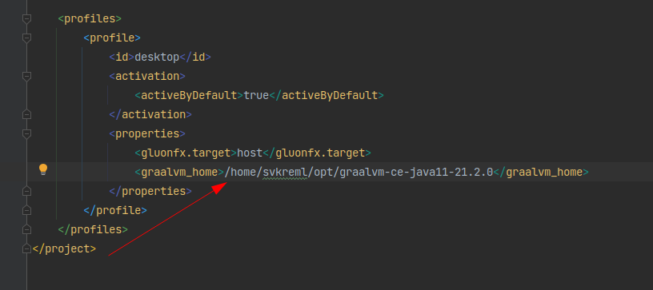

## GraalVmJavaFxHelloWorld

для запуска необходимо указать в профиле путь к graalvm_home



Для нативной сборки используется https://github.com/gluonhq/gluonfx-maven-plugin


Если ошибка Failed to execute goal com.gluonhq:gluonfx-maven-plugin:1.0.7:build (default-cli) on project GraalVmJavaFxHelloWorld: Error, gluonfx:build failed: Error while executing process. Cannot run program "/home/svkreml/.local/share/JetBrains/Toolbox/apps/IDEA-U/ch-0/211.7142.45/plugins/maven/lib/maven3/bin/mvn" (in directory "/home/svkreml/IdeaProjects/GraalVmJavaFxHelloWorld"): error=13, Отказано в доступе,
то надо сделать его исполняемым


Прежде чем проект успешно соберётся, он будет долго писать про необходимость скачивания различных библиотек, которые придётся установить

Инструкция по сборке https://docs.gluonhq.com/#_the_gluon_client_plugin_for_maven


Собранный исполняемый файл находится примерно здесь


```shell
~/IdeaProjects/GraalVmJavaFxHelloWorld> mvn clean com.gluonhq:gluonfx-maven-plugin:1.0.7:build
[INFO] Scanning for projects...
[INFO] 
[INFO] ----------------< org.example:GraalVmJavaFxHelloWorld >-----------------
[INFO] Building GraalVmJavaFxHelloWorld 1.0-SNAPSHOT
[INFO] --------------------------------[ jar ]---------------------------------
[INFO] 
[INFO] --- maven-clean-plugin:2.5:clean (default-clean) @ GraalVmJavaFxHelloWorld ---
[INFO] Deleting /home/svkreml/IdeaProjects/GraalVmJavaFxHelloWorld/target
[INFO] 
[INFO] ----------------< org.example:GraalVmJavaFxHelloWorld >-----------------
[INFO] Building GraalVmJavaFxHelloWorld 1.0-SNAPSHOT
[INFO] --------------------------------[ jar ]---------------------------------
[INFO] 
[INFO] --- gluonfx-maven-plugin:1.0.7:build (default-cli) @ GraalVmJavaFxHelloWorld ---
[INFO] Scanning for projects...
[INFO] 
[INFO] ----------------< org.example:GraalVmJavaFxHelloWorld >-----------------
[INFO] Building GraalVmJavaFxHelloWorld 1.0-SNAPSHOT
[INFO] --------------------------------[ jar ]---------------------------------
[INFO] 
[INFO] >>> gluonfx-maven-plugin:1.0.7:compile (default-cli) > process-classes @ GraalVmJavaFxHelloWorld >>>
[INFO] 
[INFO] --- maven-resources-plugin:2.6:resources (default-resources) @ GraalVmJavaFxHelloWorld ---
[INFO] Using 'UTF-8' encoding to copy filtered resources.
[INFO] Copying 0 resource
[INFO] 
[INFO] --- maven-compiler-plugin:3.8.1:compile (default-compile) @ GraalVmJavaFxHelloWorld ---
[INFO] Changes detected - recompiling the module!
[INFO] Compiling 1 source file to /home/svkreml/IdeaProjects/GraalVmJavaFxHelloWorld/target/classes
[INFO] 
[INFO] <<< gluonfx-maven-plugin:1.0.7:compile (default-cli) < process-classes @ GraalVmJavaFxHelloWorld <<<
[INFO] 
[INFO] 
[INFO] --- gluonfx-maven-plugin:1.0.7:compile (default-cli) @ GraalVmJavaFxHelloWorld ---
[пт окт. 15 13:22:08 MSK 2021][INFO] ==================== COMPILE TASK ====================
             _______  ___      __   __  _______  __    _
            |       ||   |    |  | |  ||       ||  |  | |
            |    ___||   |    |  | |  ||   _   ||   |_| |
            |   | __ |   |    |  |_|  ||  | |  ||       |
            |   ||  ||   |___ |       ||  |_|  ||  _    |
            |   |_| ||       ||       ||       || | |   |
            |_______||_______||_______||_______||_|  |__|

    Access to the latest docs, tips and tricks and more info on
    how to get support? Register your usage of Gluon Substrate now at

    https://gluonhq.com/activate


[пт окт. 15 13:22:09 MSK 2021][INFO] We will now compile your code for x86_64-linux-linux. This may take some time.
[пт окт. 15 13:22:10 MSK 2021][INFO] [SUB] Warning: Ignoring server-mode native-image argument --no-server.
[пт окт. 15 13:22:12 MSK 2021][INFO] [SUB] [svkreml.graalvmjavafxhelloworld.mainapp:31805]    classlist:   1,621.25 ms,  0.96 GB
[пт окт. 15 13:22:12 MSK 2021][INFO] [SUB] [GluonFeature] enabled for config com.oracle.svm.hosted.FeatureImpl$IsInConfigurationAccessImpl@59aa20b3
[пт окт. 15 13:22:13 MSK 2021][INFO] [SUB] [svkreml.graalvmjavafxhelloworld.mainapp:31805]        (cap):     419.09 ms,  0.96 GB
[пт окт. 15 13:22:13 MSK 2021][INFO] [SUB] GluonFeature enabled in setup com.oracle.svm.hosted.FeatureImpl$DuringSetupAccessImpl@5f303ecd
[пт окт. 15 13:22:14 MSK 2021][INFO] [SUB] [svkreml.graalvmjavafxhelloworld.mainapp:31805]        setup:   2,136.51 ms,  0.96 GB
[пт окт. 15 13:23:13 MSK 2021][INFO] [SUB] [svkreml.graalvmjavafxhelloworld.mainapp:31805]     (clinit):     699.59 ms,  5.41 GB
[пт окт. 15 13:23:13 MSK 2021][INFO] [SUB] [svkreml.graalvmjavafxhelloworld.mainapp:31805]   (typeflow):  28,742.12 ms,  5.41 GB
[пт окт. 15 13:23:13 MSK 2021][INFO] [SUB] [svkreml.graalvmjavafxhelloworld.mainapp:31805]    (objects):  24,516.86 ms,  5.41 GB
[пт окт. 15 13:23:13 MSK 2021][INFO] [SUB] [svkreml.graalvmjavafxhelloworld.mainapp:31805]   (features):   2,323.88 ms,  5.41 GB
[пт окт. 15 13:23:13 MSK 2021][INFO] [SUB] [svkreml.graalvmjavafxhelloworld.mainapp:31805]     analysis:  58,195.68 ms,  5.41 GB
[пт окт. 15 13:23:16 MSK 2021][INFO] [SUB] [svkreml.graalvmjavafxhelloworld.mainapp:31805]     universe:   2,819.18 ms,  5.49 GB
[пт окт. 15 13:23:18 MSK 2021][INFO] [SUB] [svkreml.graalvmjavafxhelloworld.mainapp:31805]      (parse):   2,246.66 ms,  5.49 GB
[пт окт. 15 13:23:23 MSK 2021][INFO] [SUB] [svkreml.graalvmjavafxhelloworld.mainapp:31805]     (inline):   4,814.60 ms,  5.76 GB
[пт окт. 15 13:24:03 MSK 2021][INFO] [SUB] [svkreml.graalvmjavafxhelloworld.mainapp:31805]    (compile):  39,881.54 ms,  5.87 GB
[пт окт. 15 13:24:05 MSK 2021][INFO] [SUB] [svkreml.graalvmjavafxhelloworld.mainapp:31805]      compile:  49,005.17 ms,  5.87 GB
[пт окт. 15 13:24:10 MSK 2021][INFO] [SUB] [svkreml.graalvmjavafxhelloworld.mainapp:31805]        image:   5,400.33 ms,  6.07 GB
[пт окт. 15 13:24:11 MSK 2021][INFO] [SUB] [svkreml.graalvmjavafxhelloworld.mainapp:31805]        write:     300.47 ms,  6.07 GB
[пт окт. 15 13:24:11 MSK 2021][INFO] [SUB] [svkreml.graalvmjavafxhelloworld.mainapp:31805]      [total]: 119,989.57 ms,  6.07 GB
[пт окт. 15 13:24:11 MSK 2021][INFO] [SUB] # Printing build artifacts to: /home/svkreml/IdeaProjects/GraalVmJavaFxHelloWorld/target/gluonfx/x86_64-linux/gvm/GraalVmJavaFxHelloWorld/svkreml.graalvmjavafxhelloworld.mainapp.build_artifacts.txt
[INFO] 
[INFO] --- gluonfx-maven-plugin:1.0.7:link (default-cli) @ GraalVmJavaFxHelloWorld ---
[пт окт. 15 13:24:11 MSK 2021][INFO] ==================== LINK TASK ====================
[INFO] ------------------------------------------------------------------------
[INFO] BUILD SUCCESS
[INFO] ------------------------------------------------------------------------
[INFO] Total time:  02:05 min
[INFO] Finished at: 2021-10-15T13:24:12+03:00
[INFO] ------------------------------------------------------------------------
[INFO] ------------------------------------------------------------------------
[INFO] BUILD SUCCESS
[INFO] ------------------------------------------------------------------------
[INFO] Total time:  02:06 min
[INFO] Finished at: 2021-10-15T13:24:12+03:00
[INFO] ------------------------------------------------------------------------
```

