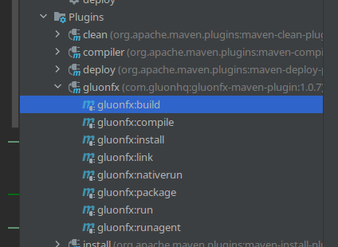
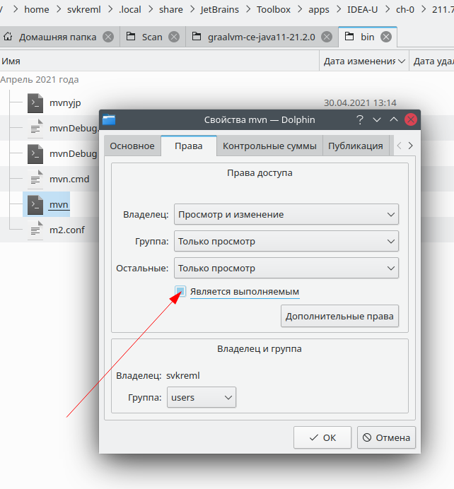
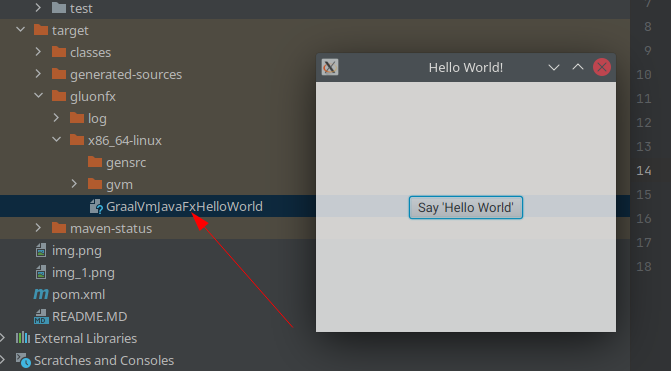

## GraalVmJavaFxHelloWorld

для запуска необходимо указать в профиле путь к graalvm_home

Для нативной сборки используется https://github.com/gluonhq/gluonfx-maven-plugin

Если ошибка Failed to execute goal com.gluonhq:gluonfx-maven-plugin:1.0.7:build (default-cli) on project GraalVmJavaFxHelloWorld: Error, gluonfx:build failed: Error while executing process. Cannot run program "/home/svkreml/.local/share/JetBrains/Toolbox/apps/IDEA-U/ch-0/211.7142.45/plugins/maven/lib/maven3/bin/mvn" (in directory "/home/svkreml/IdeaProjects/GraalVmJavaFxHelloWorld"): error=13, Отказано в доступе,
то надо сделать его исполняемым

Прежде чем проект успешно собирётся он будет долго писать про необходимость скачивания различных библиотек, которые придётся установить

Собранный исполняемый файл находится примерно здесь

